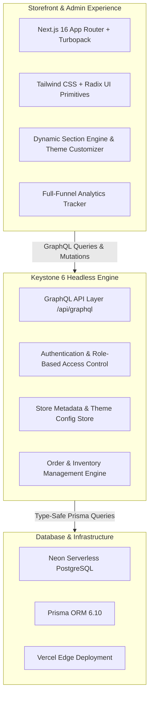

# 🛍️ Apex Commerce: Shopify-Grade Commerce Engine
### *The High-Performance, Zero-Plugin-Tax E-Commerce Platform*

---

## 🌟 1. Vision, Mission & Why We Are Building This

### 🎯 The Core Problem with Shopify & Existing Builders
Traditional e-commerce platforms like Shopify present massive hurdles for emerging brands and high-growth merchants:
1. **The "App Tax" ($200–$500+/mo)**: Simple essential features like slide-out cart drawers, color swatches, announcement bars, sticky checkout buttons, and proper Facebook Pixel tracking require 6–10 separate monthly subscription apps that slow down site speed.
2. **Broken Ad Attribution**: Most third-party pixel apps only track superficial `PageView` or incomplete `AddToCart` events, leaving merchants blind to checkout drop-offs, ROAS loss, and ad misattribution on Meta & Google.
3. **Sluggish Liquid Templates**: Outdated template engines create poor Core Web Vitals (LCP/INP) and high bounce rates.
4. **High Transaction Fees**: Traditional platforms charge penalty transaction fees if merchants don't use their proprietary payment rails.

---

### 🚀 Our Vision
> **To democratize enterprise-grade e-commerce by providing modern direct-to-consumer (D2C) brands with a lightning-fast, visually customizable, and conversion-optimized storefront at a fraction of legacy SaaS costs.**

### 🏆 Our Mission
1. **Zero-App Overhead**: Provide all high-converting features natively (Slide-out cart, live typeahead search, color swatches, sticky bars, promo tickers, trust badges).
2. **True Full-Funnel Marketing Attribution**: Standardized, deterministic tracking covering every step from visitor arrival (`PageView`) to checkout completion (`Purchase`) out-of-the-box.
3. **Sub-Second Performance**: Next.js 16 App Router + Turbopack + Edge Delivery for instant page transitions.
4. **Developer Freedom & Merchant Simplicity**: Non-technical merchants customize visual sections in a clean dashboard, while developers retain 100% control over the codebase.

---

## 🏗️ 2. System Architecture & Tech Stack



---

## 📦 3. Comprehensive Feature & Implementation Catalog

### 🎨 Phase 1: Visual Theme & Section Customizer
* **Location**: Admin Dashboard &rarr; **Platform &rarr; Store Settings** (`/dashboard/platform/store`).
* **Capabilities**:
  * **Top Announcement Bar**: Toggle on/off, custom text, promotional link, background color & text color pickers with real-time preview.
  * **Hero Banner Builder**: Main headline, subheadline, badge pill, background image URL, primary and secondary CTA buttons & links.
  * **Modular Section Toggles**: Instant switches to enable/disable the *Infinite Marquee USP Ticker*, *Verified Customer Reviews*, and *Trust & Security Guarantees*.
  * **Brand Identity**: Store name, logo SVG, and accent hue presets.
* **Architecture**: Stored inside `Store.metadata` JSON column in PostgreSQL with instant on-demand cache revalidation (`revalidatePath('/', 'layout')`).

---

### 📊 Phase 2: Full-Funnel Meta Pixel & GA4 Attribution Engine
* **Location**: Admin Dashboard &rarr; **Platform &rarr; Apps & Integrations** (`/dashboard/platform/apps`).
* **Capabilities**:
  * Enter **Meta Pixel ID** and **Google Analytics 4 Measurement ID** once to activate full-funnel tracking across the entire shopping journey.
  * Server-side and client-side event dispatching via [`events.ts`](file:///Users/aaravsharma/Desktop/E-commerce/features/storefront/lib/analytics/events.ts).
* **Automated Funnel Events**:
  1. `PageView`: Dynamic route and SPA navigation tracking.
  2. `ViewContent`: Product detail views with product ID, title, category, and localized price.
  3. `AddToCart`: Fired on variant add with item ID, quantity, and currency.
  4. `InitiateCheckout`: Fired on checkout entry with full line items array and cart total.
  5. `Purchase`: Fired on order confirmation with transaction ID, revenue, tax, and shipping breakdowns.

---

### 🛒 Phase 3: High-Converting Slide-Out Cart Drawer & Live Search
* **Cart Drawer** ([`CartDrawer.tsx`](file:///Users/aaravsharma/Desktop/E-commerce/features/storefront/modules/layout/components/cart-drawer/index.tsx)):
  * **Dynamic Free Shipping Progress Meter**: Calculates progress toward $75 threshold with an animated status bar (*"Add $14.50 more for Free Shipping!"* &rarr; *"🎉 You unlocked Free Express Shipping!"*).
  * **Interactive Line Items**: Quantity stepper (+ / -), instant item removal, and live price updates.
  * **Direct Checkout Action**: High-contrast primary CTA button leading straight to checkout.
* **Instant Typeahead Live Search** ([`SearchModal.tsx`](file:///Users/aaravsharma/Desktop/E-commerce/features/storefront/modules/layout/components/search-modal/index.tsx)):
  * Press **`Cmd + K`** or click header search to open a debounced live search dialog with image thumbnails and instant price lookups.
  * Case-insensitive matching across product titles, subtitles, and URL handles.

---

### 👕 Phase 4: Shopify-Grade Product Detail Page (PDP)
* **Interactive Color & Size Swatch Matrix** ([`option-select.tsx`](file:///Users/aaravsharma/Desktop/E-commerce/features/storefront/modules/products/components/product-actions/option-select.tsx)):
  * Circular visual color dots with active selection rings for colors (Black, White, Blue, Red, Green, etc.).
  * Tactile size pill buttons with automatic variant state synchronization.
* **Mobile & Desktop Sticky Add-to-Cart Bar** ([`StickyCartBar.tsx`](file:///Users/aaravsharma/Desktop/E-commerce/features/storefront/modules/products/components/sticky-cart-bar/index.tsx)):
  * Floats at the bottom of the viewport when scrolling past the main product section, displaying the product image, selected variant, price, and an instant "Add to Bag" button.

---

### 🔌 Dedicated Apps & Marketing Integrations Hub
* **Location**: Admin Dashboard &rarr; **Platform &rarr; Apps & Integrations** (`/dashboard/platform/apps`).
* **Tabs**:
  1. **Marketing & Pixels**: Meta Pixel, Conversions API (CAPI), Google Analytics 4, TikTok Pixel, Google Tag Manager.
  2. **Fulfillment Apps**: Openship Shop, Openship Multi-Warehouse Channel routing.
  3. **Custom OAuth**: Private API keys and developer OAuth apps.

---

## 🛠️ 4. Admin Credentials & Local Environment

```yaml
Admin Signin: http://localhost:3000/dashboard/signin
Email:        admin@openfront.io (or admin@gmail.com)
Password:     AdminPassword123!
```

---

## 🚀 5. Deployment Instructions (Vercel + Neon)

1. Push all code to your GitHub repository `https://github.com/Aashish3071/e-commerce`.
2. Ensure Vercel environment variables are configured:
   * `DATABASE_URL`: Your pooled Neon connection string.
   * `DATABASE_URL_UNPOOLED`: Your direct (unpooled) Neon connection string.
   * `SESSION_SECRET`: 32+ character secure random string.
3. Vercel will automatically run migrations and deploy the production bundle in one shot!
